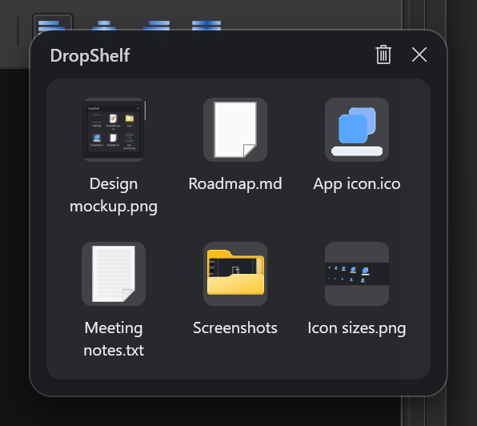
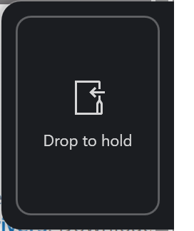
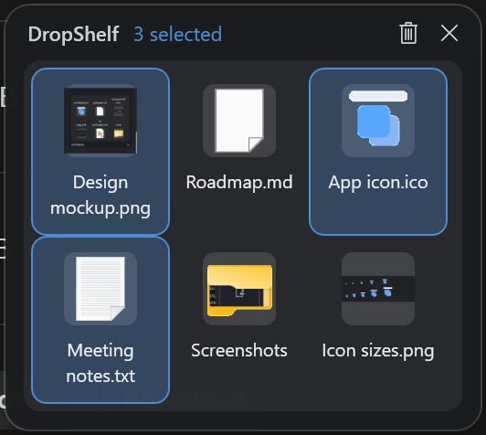

# DropShelf

A drag-and-drop staging shelf for Windows.



## The problem

Windows makes you finish a drag in one motion. Pick a file up in one window and,
if the destination is not already visible, you are stuck. You cannot switch apps,
scroll to find the folder, or change virtual desktop without letting go of what
you are holding.

DropShelf gives you somewhere to put it down. Drop files onto the shelf, go and
find the destination at your own pace, then drag them back off.

macOS has had Dropover and Yoink for years. Windows has not had a good equivalent.

## Using it

**Put something on the shelf.** Press `Ctrl+Shift+D` to summon the shelf and drop
onto it. Or, while already dragging, push the pointer against the right hand edge
of the screen and a catcher slides in to drop onto.



**Take something off.** Drag any tile out to Explorer, an upload field, an email,
anywhere that accepts a file.

**Take several off at once.** Click to select, `Ctrl+click` to add or remove one,
`Shift+click` to extend a run. Then drag any selected tile and the whole group
goes together, in the order you see on screen.



By default items stay on the shelf after you drag them out, so you can drop the
same file in several places. Turn on **Remove items after dragging them out** in
the tray menu if you would rather treat the shelf as a queue that empties as you
work through it.

**Everything else.**

| Action | What happens |
| --- | --- |
| `Ctrl+Shift+D` | Show or hide the shelf |
| Click the tray icon | Show or hide the shelf |
| Drag the header bar | Move the shelf |
| Click a tile | Select it |
| `Ctrl+click` | Add or remove one tile from the selection |
| `Shift+click` | Select everything between here and the last one |
| Click the background | Clear the selection |
| Double click a tile | Open the file |
| Hover a tile | A remove badge appears |
| Bin icon in the header | Take everything off |

The shelf stores paths, not copies. Holding a 4GB video costs nothing, and
nothing is duplicated on your disk. The other side of that is an item going stale
if you move or delete the file while it is on the shelf.

## What it handles

Not everything you drag is a file yet, and the awkward cases are handled.

- **Files and folders** from Explorer, straight through.
- **Email attachments** from Outlook or Gmail, which are offered as a promise
  rather than a file and have to be requested from the source application.
- **Images from web pages**, which arrive as pixels and get written out as PNG.
- **Links**, saved as a shortcut so the tile shows the site's icon.
- **Selected text**, saved as a text file named after its first line.

Anything that was not already a file gets written to
`%LOCALAPPDATA%\DropShelf\Staged`. Nothing there is ever deleted automatically,
because a saved attachment may be the only copy you have. Open that folder from
the tray menu when you want to clear it out.

## Running it

Requires Windows 10 version 1809 or later.

Build and run from source with the .NET 9 SDK:

```
dotnet run --project src/DropShelf
```

Or build a standalone executable that needs no .NET installed:

```
powershell -ExecutionPolicy Bypass -File tools\publish.ps1
```

DropShelf runs in the background with no window of its own. Look for its icon in
the notification area next to the clock, and press `Ctrl+Shift+D` or click the
icon to bring the shelf up.

## How it is built

C# and WPF on .NET 9, with no third party dependencies. Most of the interesting
work is against the Windows shell directly.

| Area | Notes |
| --- | --- |
| `Model` | The shelf and its items |
| `DropHandling` | Turning a drop into files, including virtual files |
| `Interop` | Shell thumbnails, the global hot key, the mouse hook, virtual desktops |
| `Ui` | The shelf window and the edge catcher |
| `Tray` | The notification area icon and its menu |
| `Settings` | Preferences, autostart, and remembering the shelf |

Two problems shaped the design more than anything else, and both are written up in
[ROADMAP.md](ROADMAP.md): Windows has no supported way to pin a window to every
virtual desktop, and nothing tells an application that a drag has begun.

Run the tests with `dotnet test`.

## Licence

MIT. See [LICENSE](LICENSE).
